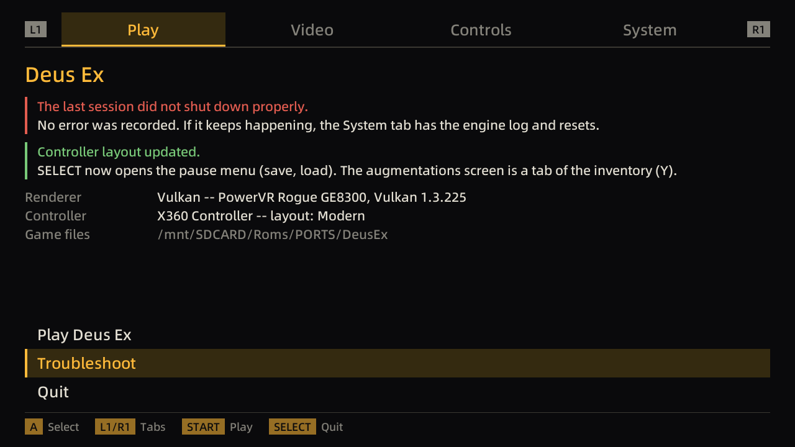

# Design notes

Companion to the reverse-engineering spec in [`re/`](re/). That folder says what
`DeusEx.exe` *does*; this file records what this port does differently, and why.

The launcher began as a faithful reimplementation of that binary's wizard. On
the handheld most of the wizard turned out to be decoration -- Surreal Engine
ignores the keys and flags it set -- so it is now a controller-first launcher
that keeps the original's *contract* (the `FirstRun` gates, the crash
sentinel, the command-line parsing, the single-instance handoff) and replaces
its screens with settings the engine actually reads.

## Target, as measured

Probed over SSH on 2026-09-21/22, not assumed. `tools/probe-sdl.c` and
`dxl-cli --probe` reproduce it.

| | |
| --- | --- |
| Device | TrimUI Smart Pro (`hwserial TG5040`), spruceOS `PLATFORM=SmartPro` |
| SoC | Allwinner A133 `sun50iw10p1`, 4× Cortex-A53; 3 GB RAM (`free`) |
| CPU modes | The spruceOS menu runs in **power-save: cores 0 and 3 only, `conservative`, 408 MHz–1.49 GHz**. spruceOS `set_performance` = all four cores, `performance`, 1.8 GHz; `set_overclock` = 2.0 GHz (`spruce/scripts/platform/SmartPro.cfg`) |
| OS | TinaLinux "Neptune", kernel 4.9.191, **glibc 2.33**, busybox 1.36.1 |
| SDL | vendor build 2.30.8 in `/usr/trimui/lib` |
| Video driver | **`mali`** (`SDL_malivideo.c`, an EGL/fbdev driver not in upstream SDL) |
| Surface | 1280×720 @60Hz, `SDL_PIXELFORMAT_RGBX8888`, fullscreen |
| SDL renderer | **`opengles2`**, accelerated + vsync, max texture 8192² |
| GPU APIs | Vulkan **1.3.225** on the PowerVR Rogue GE8300; **OpenGL ES 3.2** (`build 1.19@6345021`) through EGL; no desktop OpenGL. Detection takes ~0.5 s |
| Pad | enumerates as `"Xbox 360 Controller"`, GUID `0300a3845e0400008e02000014010000`, **recognised by SDL_GameController with a built-in mapping** — no custom mapping needed |
| Pad controls | A B X Y, L1 R1, SELECT START MENU, d-pad (a hat), two sticks. **L2/R2 are digital**, though the mapping puts them on axes `a2`/`a5`. **No L3/R3**: the mapping lists `leftstick:b9`/`rightstick:b10`, but the sticks do not click. (Controls per the device's owner, 2026-09-22; mapping from `tools/probe-sdl.c --pad`.) MENU belongs to spruceOS |
| Fonts | `/usr/trimui/res/regular.ttf`, `full.ttf`; `/mnt/SDCARD/spruce/Font Files/Noto.ttf` |
| Storage | SD is **exFAT** — case-insensitive, no meaningful permission bits |

## Why the toolchain choice is load-bearing

The device runs glibc 2.33. glibc 2.34 folded `libpthread`/`libdl` into `libc` and
re-versioned the startup symbols, so a toolchain built against ≥ 2.34 emits
`__libc_start_main@GLIBC_2.34` from `crt1.o` — and the binary fails to load, whatever
our own code calls.

Measured:

| Toolchain | gcc | glibc | Result |
| --- | --- | --- | --- |
| Arch `aarch64-linux-gnu-gcc` | 16 | 2.44 | rejected |
| ARM GNU 13.3.rel1 | 13.3 | 2.38 | rejected — emitted `GLIBC_2.34` in a one-line test |
| **Bootlin `stable-2020.08-1`** | 9.3 | **2.31** | **the launcher** — emits only `GLIBC_2.17`, verified on the device |
| **Bootlin `bleeding-edge-2021.05-1`** | 10.3 | **2.33** | **the engine** — C++20 capable, exact glibc match |

Two toolchains, because the launcher is C11 and Surreal Engine needs C++20, which
gcc 9.3 cannot build. The C++20 one links `libstdc++` and `libgcc` statically;
the device ships `libstdc++.so.6.0.28` (`GLIBCXX_3.4.28`) which gcc 10.3 would
actually be compatible with — static linking just removes the question, at ~1 MB.

Trying to keep one toolchain by pointing a modern compiler at the old sysroot
failed: the sysroot's `libc.so` linker script hardcodes absolute `/lib/...`
paths, which resolve to the host's libraries.

`scripts/check-abi.sh` runs on every cross build and fails on any reference above
2.33. It is a post-build step on both the launcher and the engine.

gcc 9.3 is also stricter than the host compiler about `-Wshadow` and
`-Wformat-truncation`: build both before calling a change warning-free.

## Why we link the device's SDL2 rather than building our own

The vendor SDL2 carries a `mali` video driver that upstream SDL2 does not have, and the
device's PowerVR stack ships only `libpvrNULL_WSEGL.so` — so an upstream KMSDRM build
would have no window system to attach to. `scripts/fetch-sysroot.sh` pulls the device's
`libSDL2`, `libSDL2_ttf`, `libSDL2_image`, `libSDL2_mixer` and `libfreetype` into
`sysroot/trimui/lib`; headers come from the matching SDL 2.30.8 release tarball.

The engine needed more of the same treatment, and the device turned out to have
most of it already: `fetch-sysroot.sh` also pulls `libEGL`, `libGLESv2`,
`libopenal`, `libasound`, `libz`, `libstdc++` and the Vulkan loader. So no audio
stack had to be cross-built. Vulkan itself needs no system package — SurrealGPU
vendors the headers and loads the loader through volk at run time. The launcher's
GPU probe does the same: it `dlopen`s the Vulkan loader and EGL rather than
linking them, so a device without either still starts the launcher.

## Where the settings actually live

Surreal Engine does not read the keys the original wizard wrote. Finding out
what it *does* read decided most of this design:

| File | What the engine takes from it | Who writes it |
| --- | --- | --- |
| `<AppDir>/home/.config/SurrealEngine/Settings.json` | The renderer (`RenderDevice.Type`), VSync, anti-aliasing, lighting and gamma mode, bloom, HDR; in our fork the `Gamepad` block | The launcher (`core/engine_settings.c`) before each launch. The engine only reads it: it saves it solely from its desktop launcher window (`LauncherWindow.cpp`), which `--no-launcher` skips |
| `System/DeusEx.ini` | Everything else in `[Core.System]` etc.; client settings from `[WinDrv.WindowsClient]` (`Brightness`, `Decals`, viewport) **only until** `SE-DeusEx.ini` exists | The launcher creates it from `Default.ini` when missing; the game's own options |
| `System/SE-DeusEx.ini` | Written by the engine on its **first clean exit** (`PackageManager::SaveAllIniFiles`); from then on the engine reads **only** this, with client settings under `[Engine.SurrealClient]` | The engine; the launcher writes client settings here once it exists |
| `System/User.ini`, then `System/SE-User.ini` | Key and pad bindings (`[Engine.Input]`), the same way round | The launcher's controller layouts; the game's key menu |

So:

- **The renderer choice goes to `Settings.json`.** `[Engine.Engine]
  GameRenderDevice` is overridden inside the engine (`Engine.cpp`, "Override
  the ini file for things that are internal in Surreal Engine") — writing it,
  as the old launcher did, changed nothing.
- **A stub `DeusEx.ini` is fatal.** UE1's Core creates it from
  `Default.ini` before the launcher ever runs; Surreal Engine falls back to
  `Default.ini` only when the file is *absent*. On the device an earlier
  launcher build wrote a 212-byte `DeusEx.ini` holding only its own keys, and
  the engine died with `Could not find package Core`. `core/config.c` now
  creates `DeusEx.ini` from `Default.ini` when missing, rebuilds one that has no
  `[Core.System] Paths` (keeping its values), and creates `User.ini` from
  `DefUser.ini`.
- **`Settings.json` is parsed inside a catch-all.** One malformed byte and
  every setting reverts to the engine's defaults — including 4x MSAA, which is
  speckle on the PowerVR. The launcher always writes the complete
  `RenderDevice` block and replaces a file it cannot parse. A missing member
  reads as empty/false/0 (`HdrScale` 0), which is why no member is ever left out.
- **Texture/skin detail, sound quality and `MinDesiredFrameRate` are not read
  by Surreal Engine's renderer or mixer**, so the original Detail page's four
  choices are gone rather than kept as switches that do nothing.

## The launcher

A home screen with four tabs, switched with L1/R1; START launches from any tab.



| Tab | Contents |
| --- | --- |
| Play | Play / Quit; what will happen (renderer and GPU, controller and layout, game folder); a crash banner quoting the engine's last error when `Running.ini` survived; notes when the launcher repaired `DeusEx.ini` or changed the pad layout |
| Video | Renderer (a picker listing Vulkan, OpenGL ES and Software with why each can or cannot run), **CPU mode**, VSync, Brightness, Lighting, Gamma curve, Bloom and its strength, Anti-aliasing (locked off on PowerVR, with the reason), Decals |
| Controls | Controller detected, in-game pad support on/off, layout preset, **Customize buttons**, look speed X/Y, invert, dead zone, menu pointer speed |
| System | Last run (from `run-game.log`), the engine log on screen, clear crash marker, reset video / controls / game configuration (each confirmed first), game files, version |

Every row has a line of help that says what it changes in the engine, not its
name again. The rows are a table (`ui/screens_internal.h` `dxl_row`); drawing,
scrolling, the help pane and button hints are written once in `ui/screens.c`.

**Renderers** (`core/renderers.c`, `platform/gpu_probe.c`). Two facts decide
whether one can be chosen, and the picker shows both: whether the *engine build*
has a backend for it (`renderers.ini` `EngineType`, the `Settings.json` value;
empty means no), and whether the *device* has the API it needs (the GPU probe).
The probe runs in a forked child with a timeout, before the display comes up,
so a driver that crashes or hangs costs the child, not the launcher -- the
original's reason for running `-testrendev` in a child. On the Smart Pro:
Vulkan selectable; OpenGL ES present on the device but not in the engine;
Software not in the engine. If `Settings.json` names a renderer that cannot run
here, a launch switches to one that can, and says so in the log.

**CPU mode** (Video tab; `launcher.ini` `CpuMode`; applied by `run-game.sh`).
Smart / Performance (default) / Overclock -- spruceOS's own names and helpers,
the ones its Ports launcher uses. The menu leaves the handheld in power-save,
which costs about a third of the frame rate; `run-game.sh` switches mode just
before the engine starts and restores the exact previous state (online cores,
governor, min/max) when it exits. The spruce helpers are sourced in subshells
only: `helperFunctions.sh` exports its own `LD_LIBRARY_PATH`, which hid
`libSurrealVideo.so` from the engine the one time it was sourced directly.

**Launch flow** (`main.c`). The home screen opens every time; the original's
entry decision (`core/policy.c`, unchanged) now picks *where* it opens: first
run and `-changevideo` on Video, `-safe` on System, a surviving crash sentinel
on Play with the cursor on Troubleshoot. `DXL_NO_HOME=1` restores the old
"ask nothing, exec straight in" behaviour for unattended runs over SSH (it still
shows a screen when the decision itself has a question). Leaving with Quit
saves settings but creates no sentinel.

## Controller support

**In the launcher**: d-pad/left stick move, A select, B back (on Play: quit),
X reset the focused setting, L1/R1 tabs, START play, SELECT/MENU quit.

**In the game** (engine fork, `engine-patches` 0003 — see its README): the SDL2
backend exposes the pad as polled state; `GamepadInput` turns it into the UE1
joystick keys and axes, so what each control does is ordinary `User.ini`
`[Engine.Input]` bindings — the same table as the keyboard, editable in the
game's key menu too.

- Buttons: A=`Joy1` B=`Joy2` X=`Joy3` Y=`Joy4` L1=`Joy5` R1=`Joy6`
  SELECT=`Joy7` START=`Joy8` L2=`Joy11` R2=`Joy12` (triggers count past half
  travel), d-pad = `JoyPov*`. MENU is spruceOS's. `Joy9`/`Joy10` (stick clicks)
  exist in the engine but not on this device.
- Sticks: `JoyX/JoyY` left, `JoyU/JoyV` right, up = positive, ±100 at full
  deflection after a radial dead zone; the look stick has a response curve.
  The engine multiplies axis input by 16 and by the binding's `Speed`, so
  `Axis aBaseY Speed=3.75` equals keyboard run speed (6000).
- While a Deus Ex modal window is open (menus, inventory, conversations,
  keypads): either stick moves the pointer, A/X click, B/Y/SELECT/START are
  Escape, the d-pad is the arrow keys, L1/R1 scroll.

**Layouts** (`core/bindings.c`): presets are data -- Modern (default),
Modern with sticks swapped, and the bindings Deus Ex shipped (three buttons).
Every command a preset or the Customize screen can bind is one the game's own
key menu offers (its `MenuScreenCustomizeKeys` list, read out of `DeusEx.u`),
plus `ShowMainMenu`, the belt slots and the F3–F12 augmentation hotkeys. The
first launch that finds the shipped bindings switches to Modern once; a preset
an earlier launcher applied and a later one revised is recognised and upgraded
(`retired[]`), with a note on the Play tab saying what changed. `Gamepad.Layout`
in `Settings.json` records the preset last applied, which is what X restores a
single button to.

## Deliberate divergences from `DeusEx.exe`

| # | Original | Here | Why |
| --- | --- | --- | --- |
| 1 | Safe mode: eight checkboxes become flags (`-nosound`, `-nohard`, `-window`, ...) on a re-exec of the launcher; three of the eight were dead in the shipped binary | Dropped. The System tab (engine log, clear crash marker, resets) replaces it | Surreal Engine honours none of those flags. The corrected eight-box wiring existed (commit `ca12577`) and was removed with the page |
| 2 | Missing splash bitmap → assert → process dies before the wizard | No splash | Nothing to be missing (`0x109090A4`, [`re/live-verification.md`](re/live-verification.md)) |
| 3 | `MPLAYER` / `HEAT` console commands, one `HKLM\software\mpath` read | Dropped | Services dead since ~2001; `GotoHEAT.exe` is not shipped. [`re/porting-notes.md`](re/porting-notes.md) |
| 4 | `.ICD`→`.EXE` rewrite in `InitPathnames` | Dropped | SafeDisc artifact; the GOG build is not wrapped |
| 5 | `-make` rejected with a fatal error | Dropped | Points at `ucc`, shipped separately |
| 6 | Renderer page runs Win32 3D device detection, re-execing itself per candidate, and writes `GameRenderDevice` | Crash-isolated GPU probe (forked child); choice written to `Settings.json` `RenderDevice.Type` | Surreal Engine overrides `GameRenderDevice`. `-testrendev` is still parsed; `dxl-cli --probe` is its replacement |
| 7 | `CreateMutex` + `FindWindowEx`/`WM_COPYDATA` handoff | `flock` pidfile + abstract unix socket | Same protocol (one string, the command-line tail), different transport. The four `appStrfind` bypass tokens still skip it |
| 8 | CD check loops on `<CdPath>Textures\Palettes.utx` with a modal box | Install-validation screen | Generalises to "did the user supply the game files?", which is the actual first-run failure here |
| 9 | Driver page (2022) names the detected Direct3D card | The renderer picker's status line (GPU, API version) | The page existed to name a D3D card and point at a driver download |
| 10 | FirstTime page (2019) | Dropped; a first run opens on the Video tab with a note on Play | Its whole content was "Deus Ex is starting up for the first time" and a Run button |
| 11 | Web button `ShellExecute`s a troubleshooting URL | Dropped | No browser to hand off to, and the URL is long dead |
| 12 | Six-page modal wizard, shown only on first run, `-changevideo`, `-safe` or after a crash | Tabbed home screen on every launch; `DXL_NO_HOME=1` for the old behaviour | Settings must be reachable with a pad; a screen that appears only after a crash or a command-line flag is not |
| 13 | Detail page (sound quality, skin/world texture detail, 640×480) writes a block of `[WinDrv.WindowsClient]`/`[Galaxy...]` keys | Dropped; the Video tab carries the engine's real options | The engine's renderer and mixer read none of those keys |
| 14 | RecoveryMode page ("was not shut down properly") | Crash banner on Play quoting the engine's reported error; Troubleshoot opens System | The engine log can say *why* |
| 15 | `<Game>.ini` missing: UE1's Core creates it from `Default.ini` (before the launcher runs) | The launcher does it, and also rebuilds a stub with no `[Core.System] Paths` | See "Where the settings actually live" |

Reproduced as specified: the `FirstRun` gates (220/400/1100) and the
up-only clamp, the `Running.ini` sentinel lifecycle and its create-after-UI
ordering, the three non-equivalent command-line parsers, the single-instance
handoff.

## What was verified, and how

Host (`ctest`, 11 suites, no display): the byte-identical ini round-trip on the
shipped files; the three command-line parsers including the `appStrfind`
surprises; the entry matrix; config seeding, stub repair and the `SE-` file
targeting; the JSON model and `Settings.json` rules (corrupt file replaced,
every member written, choices validated); renderer resolution; layouts,
per-button remapping and retired-layout detection; argv construction for the
exec. `dxl-shots` renders every tab and overlay headlessly at 1280×720
(`DXL_WINDOW`) for review.

On the Smart Pro:

| Check | Result |
| --- | --- |
| glibc ABI of both launcher binaries | `GLIBC_2.17` only; the engine stays at ≤ 2.33 |
| GPU probe (`dxl-cli --probe`) | Vulkan GE8300 1.3.225, OpenGL ES 3.2, no desktop GL; 0.5 s |
| `dxl-cli --dry-run` on the broken install | found the 212-byte stub, reported the rebuild; wrote nothing (checksums unchanged) |
| Launch after the repair | the game started (it had been failing with `Could not find package Core`); owner-verified |
| CPU mode in `run-game.sh` | power-save → performance (0-3, 1.8 GHz) while running → power-save restored after |
| Home screen on the panel | renders with the device font; detected `X360 Controller`; recognised the retired layout (screenshot above) |
| Pad in game | moving, looking and firing work (owner, first build); START was swallowed after skipping the intro — fixed since, **not yet re-verified** |

Verified with the previous (wizard) build, on code paths this redesign did not
change: install validation naming each missing file; `Running.ini` created at
commit and removed by the game on clean exit; a simulated crash
(`DXL_SIMULATE_CRASH=1`) surviving to the next launch; the same sentinel with a
live instance forwarding instead; the `FirstRun=500` clamp rewriting the ini
with all 25 sections intact and no line losing its CR.

Not yet exercised on hardware: the new tabs by hand beyond the owner's first
session; the Customize buttons screen; the retired-layout upgrade being written
out (the screenshot shows it detected in memory); `DXL_NO_HOME=1`; the
messenger half of the single-instance handoff.

## The runtime behind the launcher

The launcher's final step execs a **configured** command (`launcher.ini`
`GameCommand`, default `./run-game.sh`), which is what let the whole contract be
verified before any engine existed. `run-game.sh` starts
[Surreal Engine](https://github.com/dpjudas/SurrealEngine), an open-source UE1
reimplementation that recognises this build directly: our `DeusEx.exe` SHA1
`2a933e26aa9cfb33b37f78afe21434caa031f14a` is its `DEUS_EX_1112fm` database
entry. Fork patches and the reason they stay in a fork are in
[`../engine-patches/`](../engine-patches/).

The script keeps the sentinel contract: `Running.ini` is cleared only on a clean
exit, so an engine crash still produces the crash notice on the next launch.
That required one fork fix — `GameApp::main` returned 0 even after catching an
exception, so a failed start looked clean.

The handheld used to fail at one GPU capability: `VulkanRenderDevice.cpp`
required `VK_EXT_descriptor_indexing`, which the GE8300 supports by none of the
three available routes despite advertising API 1.3.225
(`tools/probe-vulkan-caps.c`). The fork's non-bindless texture path, CPU
decoders for the formats the GPU cannot sample, and MSAA off fixed it
(`engine-patches/0002`). A software route (Mesa llvmpipe behind the engine's
desktop-GL backend) was considered and not pursued: that backend wants desktop
GL 3.2, which this device's SDL2 cannot provide.

## Performance

Measured on the device with the frame-time instrumentation in
`tools/perf-instrumentation.patch` and `tools/profile-map.sh` (start a map
directly with `--url=<map>`; the hooks are never committed):

| Scene, CPU mode | FPS | Frame | Game tick | Render CPU | GPU wait |
| --- | --- | --- | --- | --- | --- |
| Intro, power-save | ~22 | 44 ms | 6.5 | 16 | 20 |
| Intro, performance | ~30 | 33 ms | 3 | 7 | 22 |
| Liberty Island start (a firefight), power-save, turning | ~2 | ~500 ms | ~330 | ~250 | ~45 |
| Liberty Island start, performance, turning | 3.0–3.3 | ~300–340 ms | 170–200 | 80–170 | ~45 |
| Liberty Island start, performance, facing the fight | ~2 | 485–535 ms | 190–245 | 210–295 | ~75 |

(Times in ms per frame, averaged over 60 frames. The last row's runs also had
the per-class or per-function hooks on, which add their own cost.)

On Liberty Island:

- **Game tick ≈ 40%**, almost all NPC AI: 29 Terrorists ~3 ms each, 10 UNATCO
  troops, thugs, bots. Surreal's UnrealScript VM costs microseconds per
  trivial operation on this CPU (14–20k VM calls per frame; every call copies
  its argument array and re-walks the function's parameters). The single worst
  native was `CycleActors` (see engine-patches 0003); with it fixed,
  `ScriptedPawn.CheckEnemyPresence`/`Tick` and general VM overhead dominate.
- **Lightmap rebuilds ~100 ms/frame** during the firefight: muzzle flashes are
  dynamic lights, and Surreal re-lights every surface they touch on the CPU,
  ~13–19 rebuilds per frame.
- **Other render CPU ~100 ms** — not yet broken down (likely vertex animation of
  ~50 character meshes and visibility).
- **GPU ~75 ms**, and it does not overlap the CPU: `CommandBufferManager::SubmitCommands`
  waits on the frame's fence right after submitting, so a frame costs CPU + GPU,
  not the larger of the two.

Candidate work, none started: AI level of detail (tick far/unseen pawns every
2–4 frames), skipping lightmap re-lighting for short flashes and spreading
rebuilds over the four cores, a lower internal resolution with CPU/GPU overlap,
and speeding up the VM's call path. The OpenGL ES backend would not help: the
CPU is the bottleneck, and Vulkan is the better API on this GPU.

## Device probes

`tools/` holds small single-purpose programs for answering questions about the
device instead of assuming answers. The probes are not part of either build —
each is one compile against the sysroot, run over SSH:

```sh
TC=toolchain/aarch64--glibc--stable-2020.08-1/bin/aarch64-linux-gcc
$TC -O2 -mcpu=cortex-a53 -std=c11 \
    -I sysroot/trimui/include -I sysroot/trimui/include/SDL2 \
    tools/probe-vulkan-caps.c -o /tmp/probe \
    -L sysroot/trimui/lib -lvulkan -Wl,-rpath-link,sysroot/trimui/lib
scripts/check-abi.sh /tmp/probe
# scp to the device, then: LD_LIBRARY_PATH=/usr/trimui/lib:/usr/lib:/lib ./probe
```

| Tool | Answers | Links |
| --- | --- | --- |
| `probe-sdl.c` | video driver, surface size, renderer backend, what the pad reports; `--pad [s]` records every pad event with a per-axis range summary (no window; pause the menu first) | `-lSDL2` |
| `probe-vulkan.c` | is there a usable Vulkan device at all | `-lvulkan` |
| `probe-sdl-vulkan.c` | can SDL2 hand out a Vulkan surface here | `-lSDL2 -lvulkan` |
| `probe-vulkan-caps.c` | every requirement the engine's device filter checks, with a verdict | `-lvulkan` |
| `probe-texture-formats.c` | which texture formats this GPU can sample, and whether it can linearly filter them (BCn, RGB8, RGBA32F) | `-lvulkan` |
| `dxl-cli --probe` | Vulkan device and API, OpenGL ES version and renderer, desktop GL — what the launcher's renderer list is built from | built by CMake |
| `shots.c` | renders every launcher tab and overlay headlessly at 1280×720 (host only) | built by CMake |
| `profile-map.sh` + `perf-instrumentation.patch` | frame time split into input, tick, render CPU, GPU wait, lightmaps, texture uploads; tick by actor class; script functions by self time | engine, temporarily |

Each one exists because a guess about this hardware turned out to be wrong at
least once.

### What is genuinely absent

There is still no way to run the original x86 Windows `Core.dll`/`Engine.dll`/
`DeusEx.dll` on this device — no box64, box86, wine or qemu. box64's own notes
record Deus Ex under Wine as crashing before the menu on far stronger hardware,
so that route was not pursued.
