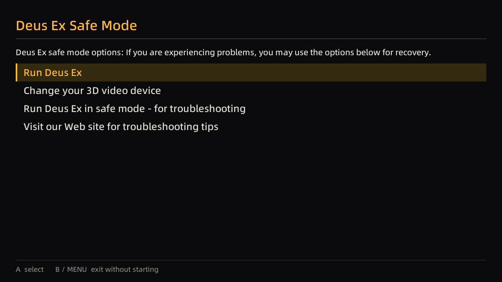

# Design notes

Companion to the reverse-engineering spec in [`re/`](re/). That folder says what
`DeusEx.exe` *does*; this file records what this port does differently, and why.

## Target, as measured

Probed over SSH on 2026-09-21, not assumed. `tools/probe-sdl.c` reproduces it.

| | |
|---|---|
| Device | TrimUI Smart Pro (`hwserial TG5040`), spruceOS `PLATFORM=SmartPro` |
| SoC | Allwinner A133 `sun50iw10p1`, 4× Cortex-A53 |
| OS | TinaLinux "Neptune", kernel 4.9.191, **glibc 2.33**, busybox 1.36.1 |
| SDL | vendor build 2.30.8 in `/usr/trimui/lib` |
| Video driver | **`mali`** (`SDL_malivideo.c`, an EGL/fbdev driver not in upstream SDL) |
| Surface | 1280×720 @60Hz, `SDL_PIXELFORMAT_RGBX8888`, fullscreen |
| Renderer | **`opengles2`**, accelerated + vsync, max texture 8192² |
| Pad | enumerates as `"Xbox 360 Controller"`, GUID `0300a3845e0400008e02000014010000`, **recognised by SDL_GameController with a built-in mapping** — no custom mapping needed |
| Fonts | `/usr/trimui/res/regular.ttf`, `full.ttf`; `/mnt/SDCARD/spruce/Font Files/Noto.ttf` |
| Storage | SD is **exFAT** — case-insensitive, no meaningful permission bits |

## Why the toolchain choice is load-bearing

The device runs glibc 2.33. glibc 2.34 folded `libpthread`/`libdl` into `libc` and
re-versioned the startup symbols, so a toolchain built against ≥ 2.34 emits
`__libc_start_main@GLIBC_2.34` from `crt1.o` — and the binary fails to load, whatever
our own code calls.

Measured:

| Toolchain | gcc | glibc | Result |
|---|---|---|---|
| Arch `aarch64-linux-gnu-gcc` | 16 | 2.44 | rejected |
| ARM GNU 13.3.rel1 | 13.3 | 2.38 | rejected — emitted `GLIBC_2.34` in a one-line test |
| **Bootlin `stable-2020.08-1`** | 9.3 | **2.31** | **the launcher** — emits only `GLIBC_2.17`, verified on the device |
| **Bootlin `bleeding-edge-2021.05-1`** | 10.3 | **2.33** | **the engine** — C++20 capable, exact glibc match |

Two toolchains, because the launcher is C11 and Surreal Engine needs C++20, which
gcc 9.3 cannot build. The C++20 one links `libstdc++` and `libgcc` statically;
the device ships `libstdc++.so.6.0.28` (`GLIBCXX_3.4.28`) which gcc 10.3 would
actually be compatible with — static linking just removes the question, at ~1 MB.

Trying to keep one toolchain by pointing a modern compiler at the old sysroot
failed: the sysroot's `libc.so` linker script hardcodes absolute `/lib/...`
paths, which resolve to the host's libraries.

`scripts/check-abi.sh` runs on every cross build and fails on any reference above
2.33. It is a post-build step on both the launcher and the engine.

## Why we link the device's SDL2 rather than building our own

The vendor SDL2 carries a `mali` video driver that upstream SDL2 does not have, and the
device's PowerVR stack ships only `libpvrNULL_WSEGL.so` — so an upstream KMSDRM build
would have no window system to attach to. `scripts/fetch-sysroot.sh` pulls the device's
`libSDL2`, `libSDL2_ttf`, `libSDL2_image`, `libSDL2_mixer` and `libfreetype` into
`sysroot/trimui/lib`; headers come from the matching SDL 2.30.8 release tarball.

The engine needed more of the same treatment, and the device turned out to have
most of it already: `fetch-sysroot.sh` also pulls `libEGL`, `libGLESv2`,
`libopenal`, `libasound`, `libz`, `libstdc++` and the Vulkan loader. So no audio
stack had to be cross-built. Vulkan itself needs no system package — SurrealGPU
vendors the headers and loads the loader through volk at run time.

## Deliberate divergences from `DeusEx.exe`

Each is argued for in the RE docs; this is the ledger.

| # | Original | Here | Why |
|---|---|---|---|
| 1 | Three safe-mode checkboxes are dead — five of eight `BM_GETCHECK` sites read the same control `+0xB0` | All eight wired independently | Shipped bug. Ticking "Disable 3D sound hardware" silently also applies `-nohard -noddraw -defaultres`, and three boxes do nothing. [`re/wizard.md`](re/wizard.md) §"Shipped bug" |
| 2 | Missing splash bitmap → assert → process dies before the wizard | Non-fatal; logged and skipped | The fallback to `..\Help\Logo.bmp` is applied without an existence check (`0x109090A4`). [`re/live-verification.md`](re/live-verification.md) |
| 3 | `MPLAYER` / `HEAT` console commands, one `HKLM\software\mpath` read | Dropped | Services dead since ~2001; `GotoHEAT.exe` is not shipped. [`re/porting-notes.md`](re/porting-notes.md) |
| 4 | `.ICD`→`.EXE` rewrite in `InitPathnames` | Dropped | SafeDisc artifact; the GOG build is not wrapped |
| 5 | `-make` rejected with a fatal error | Dropped | Points at `ucc`, shipped separately |
| 6 | Renderer page runs Win32 3D device detection, re-execing itself per candidate | Candidate list read from `renderers.ini` | There is no Win32 and no runtime yet to detect against. `GameRenderDevice` is still written exactly as before |
| 7 | `CreateMutex` + `FindWindowEx`/`WM_COPYDATA` handoff | `flock` pidfile + abstract unix socket | Same protocol (one string, the command-line tail), different transport. The four `appStrfind` bypass tokens still skip it |
| 8 | CD check loops on `<CdPath>Textures\Palettes.utx` with a modal box | Install-validation screen | Generalises to "did the user supply the game files?", which is the actual first-run failure here |
| 9 | Driver page (2022) shows the detected Direct3D card name | Folded into the renderer screen | The page exists only to name a detected D3D card and point at a driver download. Neither means anything here |
| 10 | FirstTime page (2019) reached from Detail unconditionally | Shown only on an actual first run | Its text is "Deus Ex is starting up for the first time", which `-changevideo` also got |
| 11 | Web button `ShellExecute`s the URL | Shows the address | There is no browser to hand off to, and silently doing nothing is worse than printing it |
| 12 | Wizard is a six-page modal with mouse-sized controls | One gamepad-driven screen per decision | A 1280x720 panel held in two hands. The decisions and the strings are the original's; the layout is not |

Everything else is reproduced as specified — in particular the `FirstRun` gates
(220/400/1100), the `Running.ini` sentinel lifecycle, the three non-equivalent
command-line parsers, and safe mode's **re-exec rather than in-process apply**.

## What was verified, and how

Host (`ctest`, 7 suites): the byte-identical round-trip on all three shipped
inis, the three command-line parsers including the `appStrfind` surprises, the
entry matrix with its ordering, the detail block against the values recorded in
[`re/live-verification.md`](re/live-verification.md), and the eight safe-mode
boxes each producing only their own flags.

On the Smart Pro, with a minimal real install under `Roms/PORTS/DeusEx`:

| Check | Result |
|---|---|
| glibc ABI of both binaries | `GLIBC_2.17` only |
| No game files | install reported INCOMPLETE, each missing piece named |
| Complete install, `FirstRun=0` | `renderer/firsttime`, migrate-saves set |
| Settled install (`FirstRun=1100`) | no display created at all; exec'd straight into the game command with the right argv |
| `Running.ini` lifecycle | created at commit, removed by the game on clean exit |
| Simulated crash (`DXL_SIMULATE_CRASH=1`) | sentinel survived; next launch reported `main/recovery` |
| Same sentinel, live instance | `action=forward` -- not treated as a crash |
| `FirstRun=500` clamp | rewritten to 1100; all 25 sections intact, **no line lost its CR** |
| `-safe` with a display | renders at 1280x720 using the device's own font and the real `Startup.int` strings |



Not yet exercised on hardware: the messenger half of the handoff (delivery is
covered by a unit test, and the device confirmed the `forward` decision), and
navigating the screens by hand -- there is no way to press buttons over SSH.

## The runtime behind the launcher

The launcher's final step execs a **configured** command, which is what let the
whole contract be verified before any engine existed:

```ini
[Launcher]
GameDir=/mnt/SDCARD/Roms/PORTS/DeusEx
GameCommand=./run-game.sh
```

`run-game.sh` now starts [Surreal Engine](https://github.com/dpjudas/SurrealEngine),
an open-source UE1 reimplementation. It recognises this build directly: our
`DeusEx.exe` SHA1 `2a933e26aa9cfb33b37f78afe21434caa031f14a` is its
`DEUS_EX_1112fm` database entry. Fork patches and the reason they stay in a fork
are in [`../engine-patches/`](../engine-patches/).

The script keeps the sentinel contract deliberately: `Running.ini` is cleared
only on a clean exit, so an engine crash still produces the recovery screen on
the next launch. That required one fork fix — `GameApp::main` returned 0 even
after catching an exception, so a failed start looked clean.

### Where it works, and where it stops

| | |
|---|---|
| Host (x86_64, Vulkan) | Runs. Main menu renders and takes input; New Game travels into `00_Intro` with the mission script and lip-sync running |
| TrimUI Smart Pro | Brings up SDL2 at 1280×720, identifies Deus Ex 1112fm, reads the package hashes, obtains a real Vulkan surface from the PowerVR driver — then fails device selection |

The handheld blocker is one GPU capability. `VulkanRenderDevice.cpp:34` requires
`VK_EXT_descriptor_indexing` for its bindless texture path, and the PowerVR Rogue
GE8300 supports descriptor indexing by none of the three available routes — not
the EXT extension, not the Vulkan 1.2 core feature, not the older per-extension
struct — despite advertising API 1.3.225. Everything else the filter demands is
present. `tools/probe-vulkan-caps.c` prints the whole verdict in one run.

Two ways past it, neither started:

1. **A non-bindless texture path in the fork** — conventional per-batch
   descriptor sets instead of indexed arrays. Touches `DescriptorSetManager`,
   `TextureManager`, `GetTextureIndexes` and the shaders. The only route that
   ends with the game running well on this GPU.
2. **Software rendering** — the engine's OpenGL backend has no descriptor-indexing
   concept, so Mesa llvmpipe sidesteps the gap entirely. But that backend wants
   desktop GL 3.2 and this device's SDL2 only offers GLES, so llvmpipe would need
   its own window system. Slower, and a winsys problem on top.

## Device probes

`tools/` holds small single-purpose programs for answering questions about the
device instead of assuming answers. They are not part of either build — each is
one compile against the sysroot, run over SSH:

```sh
TC=toolchain/aarch64--glibc--stable-2020.08-1/bin/aarch64-linux-gcc
$TC -O2 -mcpu=cortex-a53 -std=c11 \
    -I sysroot/trimui/include -I sysroot/trimui/include/SDL2 \
    tools/probe-vulkan-caps.c -o /tmp/probe \
    -L sysroot/trimui/lib -lvulkan -Wl,-rpath-link,sysroot/trimui/lib
scripts/check-abi.sh /tmp/probe
# scp to the device, then: LD_LIBRARY_PATH=/usr/trimui/lib:/usr/lib:/lib ./probe
```

| Probe | Answers | Links |
|---|---|---|
| `probe-sdl.c` | video driver, surface size, renderer backend, what the pad reports | `-lSDL2` |
| `probe-vulkan.c` | is there a usable Vulkan device at all | `-lvulkan` |
| `probe-sdl-vulkan.c` | can SDL2 hand out a Vulkan surface here | `-lSDL2 -lvulkan` |
| `probe-vulkan-caps.c` | every requirement the engine's device filter checks, with a verdict | `-lvulkan` |
| `probe-texture-formats.c` | which texture formats this GPU can sample, and whether it can linearly filter them (BCn, RGB8, RGBA32F) | `-lvulkan` |
| `shots.c` | renders each launcher screen headlessly (host only, built by CMake) | SDL2 + ttf |

Each one exists because a guess about this hardware turned out to be wrong at
least once.

### What is genuinely absent

There is still no way to run the original x86 Windows `Core.dll`/`Engine.dll`/
`DeusEx.dll` on this device — no box64, box86, wine or qemu. box64's own notes
record Deus Ex under Wine as crashing before the menu on far stronger hardware,
so that route was not pursued.
